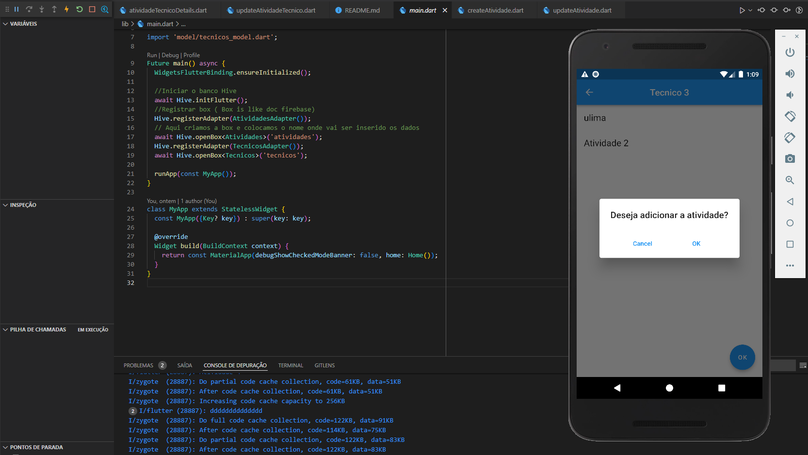
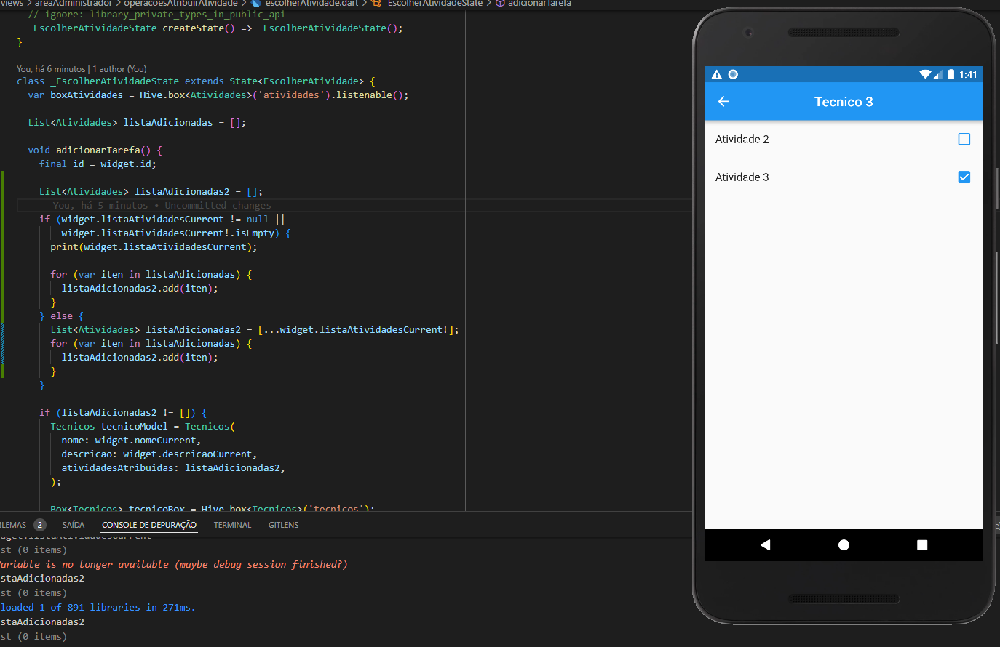

# Flutter Hive Tasks

First Step:

    flutter packages get
        
Second Step:

    flutter run

Third Step: Create new box or update a box:

    flutter packages pub run build_runner build;

#  Fast View from Project
 

# Layout Home

# Layout Atividade 

# Layout Atividade Tecnico View

